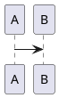

# WeChat Format (微信排版)

Converts Markdown into a self-contained HTML file styled for WeChat Official Account articles, with optional illustration embedding.

## Input / Output

| | |
|---|---|
| **Input** | Markdown text (standard + extensions below) |
| **Parameters** | `--preview` (default): local file paths + open browser. `--publish`: trigger `scripts/publish.py`. |
| **Output** | Single `.html` file, CSS embedded in `<style>`, ready to paste into 微信公众号编辑器. Written to `web-chat-artifacts/<name>.html` (see [Output Path](#output-path)). |

## Workflow

共 5 个阶段，7 个步骤，按顺序执行。

```
Phase 1 ─  Target Recognition (参数解析)
              ↓
Phase 2 ─  Illustration Matching (可能跳过)
              ↓
Phase 3 ─  Generate HTML (保留现有 wechat-format 核心逻辑)
              ↓
Phase 4 ─  Illustration Embedding (可能跳过)
              ↓
Phase 5 ─  Consume (preview / publish)
```

### Phase 1 — Target Recognition (目标识别)

根据传入参数确定消费模式：

| 参数 | 模式 | 行为 |
|------|------|------|
| `--preview` | 预览 | 图片用本地绝对路径；保存 HTML 后自动 `open` 浏览器 |
| `--publish` | 发布 | 图片用本地绝对路径；保存 HTML 后调用 `scripts/publish.py` |
| 无参数 | 默认预览 | 等同 `--preview` |

参数在 skill 调用时传入，例如 `/wechat-format --publish`。

### Phase 2 — Illustration Matching (插图匹配)

#### 2a. 询问是否需要配图

向用户确认是否需为文章配图：

- **需要配图** → 用户指定插图信息目录路径，进入 2b
- **无需配图** → 标记跳过，直接进入 Phase 3

#### 2b. 半自动映射

扫描用户指定的插图信息目录，读取两类文件：

| 文件类型 | 用途 |
|---------|------|
| `.prompt` 文件 | 提取 `diagram-slug` 列表（来自 illustration-prompt 产出） |
| 图片文件 (png/jpg/webp/…) | 待插入的配图文件 |

映射流程：

```
Step 1: 解析 .prompt 文件 → 提取 slugs（保持顺序）
               ↓
Step 2: 扫描图片文件 → 提取文件名列表（按文件名排序）
               ↓
Step 3: 自动匹配 filename == slug
        后接兜底逻辑，按结果进入三分支：
```

自动匹配后，根据匹配结果进入三分支：

| 条件 | 行为 |
|------|------|
| **至少 1 条自动匹配** | 已匹配项保留；剩余未匹配的图片和 slug **按顺序 1:1 配对** |
| **0 条匹配，且图片数 == slug 数** | **全部按顺序 1:1 一一对应**（完全跳过文件名匹配） |
| **0 条匹配，且图片数 ≠ slug 数** | 回退：逐张询问每张图片对应哪个 slug |

三分支汇合后统一进入 Step 4：

```
               ↓
Step 4: 无论哪种分支，产出完整映射表后
        统一进入用户确认（见下文「映射表确认交互」）
```

#### 2c. 构建映射表

产出配图映射表，供 Phase 4 使用：

```json
[
  {
    "slug": "leader-election",
    "img_path": "/absolute/path/to/leader-election.png",
    "prompt_location": "第 2 节 · Leader Election 首次出现段落后",
    "match_method": "auto"
  }
]
```

其中：
- `prompt_location` 直接从 `.prompt` 文件的 `Context` 区块中的"所处位置"字段读取
- `match_method` 标记配对方式：`"auto"`（文件名自动匹配）或 `"paired"`（兜底顺序配对）或 `"manual"`（逐张询问回退）

#### 映射表确认交互

三种分支汇合后，产出完整映射表，统一展示给用户确认：

```
📄 配图映射确认（共 N 张图）

  顺序 │ 图片             │ 匹配方式  │ 插入位置
  ─────┼──────────────────┼──────────┼───────────────────────
   1   │ leader-election  │ 自动匹配  │ 第 2 节 · Leader Election
   2   │ log-replication  │ 序列配对  │ 第 3 节 · Log Replication
  ...

  操作：
    Enter      → 全部确认，进入 2d
    swap 1 3   → 交换第 1 张和第 3 张的位置
    move 2 4   → 将第 2 张移到第 4 张之后
    remove 3   → 移除第 3 张图（不删除文件）
    done       → 确认并进入 2d
```

用户确认后进入 2d 封面图识别。

#### 2d. 封面图识别

构建映射表后，自动尝试识别封面图：

1. 检查配图目录是否包含独立封面图（以 `cover` 命名的文件，如 `cover.png`、`cover.jpg`）
2. 如无独立封面，将映射表**第一张图片**标记为封面候选
3. 展示给用户确认/替换封面，确认后记录到映射表

此信息将在 Phase 3 以 `<!--wechat-cover:...-->` 标记写入 HTML，供 publish.py 读取。

### Phase 3 — Generate HTML (HTML 生成)

沿用现有 wechat-format 核心逻辑，但输出改用**内联样式**（与 rebel-lion `WeChatFormatter` 一致）：

1. 理解内容语气、类型 → 推荐主题（用户确认）
2. 分析内容结构 → 识别语义单元（callout、danger card、flow-list 等）
3. 渲染 Markdown → HTML
4. 加载主题 CSS，解析所有 CSS 变量 → 对每个元素直接输出 `style=""` 内联样式
5. 执行微信兼容性转换（Mermaid 包装、tspan 等）

关键区别：步骤 4 不再生成 `<style>` 块和 CSS 类，而是将主题样式直接写入每个元素的 `style` 属性。例如：

```html
<!-- 之前 -->
<p class="codespan">code</p>
<style>.codespan{padding:2px 4px;color:#333}</style>

<!-- 现在 -->
<p style="background:#F6F0E8;padding:2px 4px;color:#333;border-radius:3px;">code</p>
```

内联样式使得 HTML 可以直接通过 draft API 提交，无需额外 CSS 内联步骤（如 rebel-lion 的做法）。

此阶段产出的 HTML **不含图片**，但需在 `<head>` 中注入 publish 标记：

```html
<!--wechat-title:文章标题-->
<!--wechat-digest:文章摘要（正文前 120 字符）-->
<!--wechat-cover:/absolute/path/to/cover.png--><!--如 Phase 2d 识别到封面-->
```

- **标题**: 取 Markdown 的第一个 `# `（最多 64 字）
- **摘要**: 取正文前 120 字符（去除 Markdown 标记，若截断点在汉字中间则以字符为准）
- **封面**: 仅当 Phase 2d 识别到封面候选时注入，否则不生成此标记

publish.py 会在上传图片和创建草稿前提取并移除这些标记，最终提交给 draft API 的内容不含这些标记。

### Phase 4 — Illustration Embedding (配图嵌入)

仅在 Phase 2 用户指定了配图时执行，否则跳过。

#### 4a. LLM 推断插入位置

基于映射表 + HTML 完整结构，由 LLM 自行推断每张图的插入位置：

```
输入:
  - 完整 HTML（不含图的结构化内容）
  - 映射表 [{slug, img_path, prompt_location}, ...]

过程:
  1. 读取 .prompt 中每张图的位置预设（自然语言描述）
  2. 对照 HTML 中各标题/段落/列表结构
  3. 推断每张图应插入在哪个元素之后

约束:
  - 不修改原文文字内容
  - 每张图生成 <figure></figure>
  - src 使用本地绝对路径（file:/// 或绝对路径均可）
```

#### 4b. 展示确认

展示合并结果供用户确认：

```
📄 已为 3 张配图定位并插入 HTML：

  ✓ leader-election   → 插入在「## Leader Election」段落后
  ✓ log-replication   → 插入在「## Log Replication」段落后
  ✓ pre-vote-compare  → 插入在「Pre-Vote 与基础选主对比」段落后

请确认或调整：
  - 位置不对 → 描述需要如何调整
  - 跳过某张 → 移除该图
  - 全部确认 → 进入消费阶段
```

### Phase 5 — Consume (消费产出)

| 模式 | 行为 |
|------|------|
| `--preview` | 保存 HTML 到 `web-chat-artifacts/<name>.html` |
| `--publish` | 1. 保存 HTML 到 `web-chat-artifacts/<name>.html`<br>2. 调用 `scripts/publish.py <html_path>`<br>3. publish.py 上传配图 → 创建草稿 → **删除 HTML 文件** |

两种模式下图片 URL 均使用本地绝对路径。publish 模式下由 `publish.py` 完成图片上传、草稿创建和产物清理。

## Syntax Reference

### Standard GFM

所有元素渲染为内联样式（`style=""`），无需 `<style>` 块。`Output element` 列标明哪个标签接收样式。

| Element | Syntax | Output element |
|---------|--------|-------------|
| Heading | `#` ~ `######` | `h1` ~ `h6` |
| Paragraph | plain text | `p` |
| Bold | `**text**` | `strong` |
| Italic | `*text*` | `em` |
| Inline code | `` `code` `` | `codespan` |
| Code block | ```` ```lang ```` | `pre.code__pre > code.language-{lang}` |
| Link | `[text](url)` | `<a>` |
| Image | `` | `<figure>` |
| Image + size | `` | `` |
| Ordered list | `1. item` | `ol > li.listitem` |
| Unordered list | `- item` | `ul > li.listitem` |
| Table | GFM pipe table | `table.preview-table > thead/th/tr/td` |
| Blockquote | `> text` | `blockquote` |
| HR | `---` / `***` / `___` | `hr.hr-dash` / `hr-star` / `hr-underscore` |

All `` elements **must** include these inline styles: `display: block; max-width: 100%; margin: 0.1em auto 0.5em; border-radius: 6px;`. No `!important` on regular content images — reserve `!important` only for WeChat compatibility transforms (tspan colors, image dimension overrides).

### WeChat Extensions

#### Text Markup
```
==highlight==      → <span class="markup-highlight">   (黄底/主题色底白字)
++underline++      → <span class="markup-underline">   (主题色下划线)
~wavyline~         → <span class="markup-wavyline">    (主题色波浪线)
```

#### Ruby Annotation (注音)
```
[文字]{zhù yīn}
[文字]^(zhu yin)
```
→ `<ruby>` tag; use `・` `．` `。` `-` to split multi-char ruby.

#### GFM Alerts / Obsidian Callouts
```
> [!NOTE]     > [!TIP]      > [!IMPORTANT]  > [!WARNING]  > [!CAUTION]
> [!ABSTRACT] > [!SUMMARY]  > [!TODO]       > [!SUCCESS]  > [!DONE]
> [!QUESTION] > [!HELP]     > [!FAILURE]    > [!DANGER]   > [!ERROR]
> [!BUG]      > [!EXAMPLE]  > [!QUOTE]      > [!CITE]     > [!INFO]
```

Each renders as:
```html
<blockquote class="markdown-alert markdown-alert-{type}">
  <p class="markdown-alert-title alert-title-{type}"><svg icon>Title</p>
  content...
</blockquote>
```

Container variant:
```
::: note
content
:::
```

#### Image Slider
```
<,,>
```
→ Horizontal scroll container with `` and `<<< 左右滑动看更多 >>>` hint.

#### LaTeX (KaTeX)
```
行内: $E=mc^2$
块级: $$E=mc^2$$
```

#### Diagrams
````


```infographic
```
````
→ Rendered as SVG, embedded inline. PlantUML uses `inlineSvg: true` mode specifically for WeChat.

#### Footnotes
```
text[^1]
[^1]: description
```
→ Superscript `[n]` in text, collected at bottom in `<p class="footnotes">`.

#### Table of Contents
```
[TOC]
```

#### Diff Code Blocks
````
```diff-js
+ console.log('added')
- console.log('removed')
```
````
→ `+` lines green bg, `-` lines red bg, rest normal highlight.

#### Code Block Decorations
Code blocks always include the macOS traffic-light SVG:
```html
<span class="mac-sign"><svg>🔴🟡🟢</svg></span>
```
And use highlight.js syntax highlighting with class-based tokens.

### Custom Components (JSX-style)

Syntax: `<ComponentName prop="value" />` (PascalCase, self-closing or open-close).

| Component | Purpose | Key props |
|-----------|---------|-----------|
| `<MpProfile />` | WeChat account card | `mpId` `nickname` `headimg` `signature` `serviceType` `verifyStatus` |
| `<QRCodeBlock />` | QR code image | `url` `text="扫码访问"` `size=150` |
| `<AuthorBlock />` | Author info card | `name` `avatar` `bio` |
| `<TipBlock />` | Info/warning box | `type=info/success/warning/danger` `title` `content` |
| `<TableBlock />` | Advanced table | `headers='["A","B"]'` `rows='[["a","b"]]'` `striped=true` `caption` |
| `<InfoGrid />` | Key-value grid | `items='[{"label":"","value":""}]'` `cols=2` |
| `<BadgeGroup />` | Tag badges | `tags='["tag1","tag2"]'` `color="#07c160"` |

Components use CSS variables for colors (fallbacks provided). **TipBlock** has 4 color variants:
- `info` → blue `#1890ff`
- `success` → green `#52c41a`
- `warning` → yellow `#faad14`
- `danger` → red `#ff4d4f`

Component templates are inline styles + CSS variables. These use `--md-comp-*` variables:
- `--md-comp-bg`: component background (default `#fff`)
- `--md-comp-bg-secondary`: secondary bg (`#f5f5f5`)
- `--md-comp-bg-stripe`: stripe bg (`#fafafa`)
- `--md-comp-text-primary`: primary text (`#333`)
- `--md-comp-text-secondary`: secondary text (`#666`)
- `--md-comp-text-tertiary`: tertiary text (`#999`)
- `--md-comp-border-default`: border (`#e0e0e0`)
- `--md-comp-border-light`: light border (`#eee`)

## Theme System

Four themes available in `references/`. Each theme file is self-contained, using CSS variables for user-customizable values. The `birch` theme is inspired by the Birch HTML design system, featuring a warm ivory background, serif headings for publication feel, and a clean spacing scale.

### CSS Variables to Resolve

When generating the final HTML, resolve these variables to concrete values (user-configured or defaults):

| Variable | Default | Description |
|----------|---------|-------------|
| `--md-primary-color` | `#0F4C81` | Theme accent color (titles, borders, highlights) |
| `--md-font-family` | `-apple-system-font, BlinkMacSystemFont, ...` | Article font stack |
| `--md-font-size` | `16px` | Base font size |
| `--foreground` | (from theme) | Text color |
| `--blockquote-background` | (from theme) | Blockquote bg |
| `--text-muted` | `#87867F` | Muted/secondary text color (figcaptions, footnotes) |
| `--code-bg` | `#F6F0E8` | Code block warm background |

**Theme names and file mapping:**

| Theme | File | Credits |
|-------|------|---------|
| `default` (经典) | `references/theme-default.css` | Core |
| `grace` (优雅) | `references/theme-grace.css` | @brzhang |
| `simple` (简洁) | `references/theme-simple.css` | @okooo5km |
| `birch` (Birch 灵感) | `references/theme-birch.css` | Birch design system |

### Theme Recommendation Guidance

Match content type to theme when recommending:

| If the content is... | Recommend | Rationale |
|----------------------|-----------|-----------|
| Formal analysis, announcements, long-form serious reading | **default** | Blue accent + structured headings convey trust, fit dense text |
| Lifestyle, culture, design, personal stories, creative | **grace** | Soft shadows + rounded corners feel warm and approachable |
| Technical docs, quick tutorials, code-heavy, minimalist | **simple** | Clean lines reduce visual noise for focused reading |
| Thoughtful essays, narrative, publication-quality long reads | **birch** | Serif headings + warm ivory background feel like a print magazine |

Always explain your recommendation in one sentence, then briefly list alternatives so the user can confirm or override.

## Content Structuring Guide

After theme selected, analyze the Markdown body to identify key semantic units that deserve visual emphasis beyond standard GFM.

### Component Mapping Table

| When you find... | Use this component | Example |
|------------------|-------------------|---------|
| The article's core thesis or central question | `.callout` with `.callout-label` | "当编码不再是稀缺资源，靠编码吃饭的人该怎么办？" |
| A critical warning, urgent risk to highlight | `.card.card-danger` | "不是 AI 会取代你，而是 AI 产出了一堆你理解不了的东西" |
| A key quote or standalone insight worth emphasizing | `.card.card-filled` with larger serif text | "LLM 不会恐惧复杂度。而且它是史上最高产的程序员。" |
| A set of sequential steps, numbered principles, or action items | `<ol class="flow-list">` with `.flow-step` + `.flow-num` | 四条行动原则 / 三步操作指南 |
| Final takeaways, conclusions, or dual insights | `<ul class="insight-list">` with `.insight-marker` | 结尾两个金句收束 |

### Rules

- **Do not overuse**: Each `<section>` should contain at most one special component (callout or card). If everything is emphasized, nothing is.
- **Ordinary narrative stays as `<p>`**: Only elevate the 2–5 most critical information nodes in the entire article.
- **Flow list for numbered sequences only**: Use `.flow-list` when the Markdown has an ordered list that represents sequential steps, not arbitrary numbered items. When the list represents key principles, core capabilities, or takeaways that need step-like emphasis, prefer `.flow-list` over plain `<ol>` with custom text markers — the component's numbered badge is visually distinct from ordinary bold text.
- **Plain ordered list**: If a numbered list does not qualify as a `.flow-list` but needs custom numbering (e.g., `<ol style="list-style:none">` with text markers), ensure the number marker has explicit visual distinction from surrounding `<strong>` elements. Apply a background badge, different font weight/color, or larger font size so readers can immediately recognize it as a list index.
- **Insight list for takeaways only**: Use at the end of an article or a major section to list key conclusions.
- **Never nest components** inside each other.

### Heading Style Overrides

In addition to the theme, users can configure per-level heading styles:

| Style | CSS output |
|-------|-----------|
| `default` | Theme default |
| `color-only` | `color: var(--md-primary-color)` |
| `border-bottom` | `border-bottom: 2px solid var(--md-primary-color)` |
| `border-left` | `border-left: 4px solid var(--md-primary-color)` |

These are applied AFTER the theme CSS (higher specificity: `#output section h1`).

⚠️ **Heading margin rule**: When applying heading overrides, preserve the theme's left/right margin strategy. Use `margin: {top} auto {bottom}` for centered headings, or `{top} 0 {bottom}` for left-aligned. Never use arbitrary pixel values like `8px` for left/right margins — they create an unintentional indent that doesn't align with the rest of the content.

### Typography Notes

The `birch` theme and all enhanced themes share these typography improvements for a more refined reading experience:

- **Serif headings** (`h1`–`h3`): Use `Georgia, "Times New Roman", "PingFang SC", serif` for a publication feel. Body text remains sans-serif for comfort on mobile.
- **Text rendering**: `-webkit-font-smoothing: antialiased` + `text-rendering: optimizeLegibility` for sharper characters.
- **Spacing rhythm**: Standardized vertical spacing — `h2` gets `margin-top: 32px`, each `<p>` gets `margin-bottom: 0.75em` to create visible paragraph breaks. Do NOT use `margin: 0` on body paragraphs — that collapses visual separation between blocks of text. Blockquote-internal `<p>` still uses `margin: 0`.
- **Muted text color**: `#87867F` for figcaptions, footnotes, and secondary content — reduces visual noise.

Apply these patterns even when users don't explicitly opt in — they're universal readability improvements.

### User Customization Options

When the user provides or you infer preferences:

| Option | Values |
|--------|--------|
| Font | sans-serif / serif / monospace (see font stacks below) |
| Font size | 14px / 15px / 16px / 17px / 18px |
| Primary color | 12 presets: classic blue `#0F4C81`, emerald `#009874`, orange `#FA5151`, yellow `#FECE00`, lavender `#92617E`, sky blue `#55C9EA`, rose gold `#B76E79`, olive `#556B2F`, graphite `#333333`, smoke `#A9A9A9`, sakura pink `#FFB7C5` |
| Paragraph indent | `text-indent: 2em` on `#output p` (boolean) |
| Text justify | `text-align: justify` on `#output p` (boolean) |
| Line numbers | On code blocks (boolean) |
| Code block theme | Any highlight.js theme (e.g., `github`, `monokai-sublime`, `atom-one-dark`) |

Font stacks:
- **Sans-serif**: `-apple-system-font, BlinkMacSystemFont, Helvetica Neue, PingFang SC, Hiragino Sans GB, Microsoft YaHei UI, Microsoft YaHei, Arial, sans-serif`
- **Serif**: `Optima-Regular, Optima, PingFangSC-light, PingFangTC-light, 'PingFang SC', Cambria, Cochin, Georgia, Times, 'Times New Roman', serif`
- **Monospace**: `Menlo, Monaco, 'Courier New', monospace`

## WeChat Compatibility Transforms

Applied during Phase 3. Each transform is a lossless equivalence — browser rendering is unchanged.

### Mermaid SVG Wrap

WeChat strips bare `<svg>`. Wrap in `<section>` to preserve.

```
Before: <div class="mermaid-diagram"><svg ...>...</svg></div>
After:  <div class="mermaid-diagram"><section style="max-width:100%;overflow-x:auto;-webkit-overflow-scrolling:touch"><svg ...>...</svg></section></div>
```

Apply to all `<svg>` inside any element with class `mermaid-diagram`.

### SVG Text Color

WeChat overwrites `<tspan>` fill color. Force with `!important`.

```
Before: <tspan class="...">text</tspan>
After:  <tspan class="..." style="fill:#333333!important;color:#333333!important;stroke:none!important">text</tspan>
```

If `<tspan>` already has `style`, append these declarations.

### SVG dominant-baseline → dy

WeChat X5 kernel and Safari don't support `dominant-baseline`. Replace with equivalent `dy` offset.

| Value | dy |
|-------|-----|
| `hanging` | `-0.55em` |
| `central` | `0.35em` |
| `middle` | `0.35em` |
| `alphabetic` | *(remove attr, no dy)* |
| `ideographic` | `0.18em` |
| `text-before-edge` | `-0.85em` |
| `text-after-edge` | `0.15em` |

```
Before: <text dominant-baseline="hanging" x="0" y="0">text</text>
After:  <text dy="-0.55em" x="0" y="0">text</text>
```

### Image Sizing → Inline Style

WeChat strips `width`/`height` attributes but respects inline `style`.

- Pure number (e.g., `300`) → `300px`
- Non-numeric (e.g., `50%`) → preserved
- Remove original attribute
- Append to existing `style` if present

```
Before: 
After:  
```

## Output Path

| | |
|---|---|
| **Directory** | `web-chat-artifacts/` — created as a subdirectory of the directory containing the input Markdown file |
| **Filename** | `{input-stem}.html` — same stem as the input file, with `.html` extension |
| **Auto-create** | Create the `web-chat-artifacts/` directory if it does not exist |

Examples:

| Input | Output |
|-------|--------|
| `articles/deep-dive.md` | `articles/web-chat-artifacts/deep-dive.html` |
| `./my-post.md` | `./web-chat-artifacts/my-post.html` |
| `docs/tutorials/guide.md` | `docs/tutorials/web-chat-artifacts/guide.html` |

## Output Template

```html
<!DOCTYPE html>
<html lang="zh-CN">
<head>
<meta charset="UTF-8">
<meta name="viewport" content="width=device-width, initial-scale=1.0">
<title>{article title}</title>
<!--wechat-title:{文章标题}--><!-- Phase 3 注入，publish.py 提取后移除 -->
<!--wechat-digest:{文章摘要}-->
<!--wechat-cover:{封面图本地路径}--><!-- 仅当 Phase 2d 识别到封面时注入 -->
</head>
<body style="background:{resolved-theme-bg-color};">
<div id="output">
  <section class="container mx-auto">

    <!-- first h1 stripped: title is managed by WeChat editor, not pasted into body -->
    <!-- 所有元素均为内联 style=""，由 Phase 3 步 4 解析主题 CSS 后直出 -->
    {rendered HTML content}
    {footnotes block if any}

  </section>
</div>
</body>
</html>
```

### Footnotes Block
```html
<h4>引用链接</h4>
<p class="footnotes">
  <code style="font-size:90%;opacity:0.6;">[1]</code>: <i>title</i><br/>
  ...
</p>
```

### color-mix Resolution

Since WeChat X5 Blink kernel does not support CSS `color-mix()`, each `color-mix()` call must be pre-computed to `rgba()` before output.

**Calculation method** for `color-mix(in srgb, color1 p1, color2 p2)`:

1. Parse both color values to sRGB components `(r1, g1, b1)` and `(r2, g2, b2)` in 0–1 range
2. Normalize percentages: `t = p1 / (p1 + p2)` (if only one percentage given, the other is `100% - p1`)
3. Interpolate each channel: `result = c1 × t + c2 × (1 - t)`
4. Convert back to `rgba(r, g, b, a)`, where each channel is rounded to integer 0–255

**Example**:

```css
/* Source */
--color: color-mix(in srgb, #0F4C81 10%, white);
/* Resolved */
--color: rgba(229, 237, 244, 1);
```

(即使主题 CSS 当前未使用 `color-mix()`，此方法适用于用户自定义配置或未来主题更新。)

## WeChat-Specific Caveats

These are critical — WeChat's rendering engine (X5 Blink) has unique behaviors:

1. **No CSS functions or variables**: Resolve all of these before output:
   - `var(--md-*)` → concrete value (e.g., `var(--md-primary-color)` → `#0F4C81`)
   - `hsl(var(--foreground))` → hex or static hsl (e.g., `hsl(0, 0%, 20%)` → `#333333`)
   - `color-mix(in srgb, ...)` → pre-computed `rgba()` (see [color-mix resolution](#color-mix-resolution))
   - `calc(var(--md-font-size) * 1.4)` → concrete px (e.g., `calc(16px * 1.4)` → `22.4px`)

2. **No external resources**: All CSS must be inline `<style>`. No external stylesheets, no `@import`, no webfonts. Images must use absolute URLs to hosted images (use the user's configured image hosting).

3. **`overflow-x: scroll` works**: The horizontal slider pattern uses WeChat-compatible `section` layout with `-webkit-overflow-scrolling: touch`. The scroll hint text `<<< 左右滑动看更多 >>>` is important — WeChat users need this cue.

4. **`<section>` is your friend**: WeChat's editor strips many HTML tags but preserves `<section>`, `<p>`, `<span>`, ``, `<a>`, `<blockquote>`, `<table>`, `<ul>/<ol>/<li>`, `<pre>/<code>`, `<h1>`-`<h6>`, `<figure>`, `<hr>`, `<ruby>`. Use these.

5. **`<style>` inside `<body>`**: WeChat _may_ strip `<style>` from `<head>`. To be safe, you can place a `<style>` tag inside `<body>` (before the content), but preferably keep it in `<head>` — most modern WeChat WebViews handle this.

6. **Tables need scroll wrapper**: Always wrap tables in `<section style="max-width:100%;overflow:auto;-webkit-overflow-scrolling:touch">` for mobile.

7. **Links to mp.weixin.qq.com**: Keep as normal `<a>` tags. External links should include `target="_blank"` or use the footnote system (superscript + bottom list).

8. **Code block copy safety**: Use `user-select:none` on the macOS traffic-light dots so they don't copy with the code. Use `user-select:all` or nothing on the actual code.

9. **Image sizing**: The `` extension is non-standard Markdown. The renderer extracts dimensions and sets `width`/`height` attributes on ``.

10. **Dark mode**: Each theme should provide dark mode styles via `prefers-color-scheme: dark`. The component system uses CSS variables with light fallbacks — dark mode overrides these.

11. **`color-mix()` not supported**: WeChat X5 Blink kernel does not support CSS `color-mix()`. When resolving the theme CSS for final output, replace every `color-mix()` call with a pre-computed `rgba()` value. See the [color-mix Resolution](#color-mix-resolution) section above for the calculation method.

## Scripts

### publish.py

位于 `scripts/publish.py`，通过微信公众号 API 上传配图并替换 HTML 中的本地路径为远程 URL。

```
$ python scripts/publish.py <html_path>              # 覆盖原文件
$ python scripts/publish.py <html_path> -o out.html  # 输出到新文件
$ python scripts/publish.py <html_path> --dry-run    # 仅预览，不上传
```

工作流：
1. 从 `.env` 读取 `WECHAT_APP_ID` 和 `WECHAT_APP_SECRET`
2. 扫描 HTML 中 `` 的图片
3. 自动压缩图片至 ≤1MB（`/cgi-bin/media/uploadimg` 的规格限制）
4. 调用微信 API 上传，获取 `https://mmbiz.qpic.cn/...` URL
5. 替换 HTML 中的 src 并写出

依赖：`httpx`（必需）、`Pillow`（可选，自动压缩）、`python-dotenv`（可选）

### .env

位于 `scripts/.env`，`.gitignore` 忽略。用于存储微信公众号 API 凭证：

```
WECHAT_APP_ID=wx_xxx
WECHAT_APP_SECRET=xxx
WECHAT_AUTHOR=作者名
WECHAT_PROXY=http://127.0.0.1:7890    # 代理（可选）
```

`scripts/.env.example` 为模板文件，不含真实密钥。

## Output Quality Checklist

Before saving the final HTML, verify every item below. These are the most commonly missed issues in the generated output.

- [ ] **Paragraph spacing**: Every `<p>` outside blockquote has `margin-bottom: 0.75em`. No `margin: 0` on body paragraphs.
- [ ] **No trivial reset properties**: Inline styles omit `visibility: visible`, `display: block` on block-level elements (`p`, `h1`–`h6`), and other default browser values. Only include properties that actually change the element's appearance.
- [ ] **Image styling**: Every `` has `max-width: 100%; border-radius: 6px; display: block; margin: 0.1em auto 0.5em`. No `!important` on content images (reserve for WeChat compatibility transforms only).
- [ ] **Heading margins**: `<h2>` uses `margin: {top} auto {bottom}` or `{top} 0 {bottom}` — never `8px` or other arbitrary values for left/right margins.
- [ ] **List numbering**: Custom text markers (e.g., `"1"` `"2"` `"3"`) in ordered lists have a visual badge or distinct styling — they should not look identical to ordinary `<strong>` text.
- [ ] **Cover image**: If a cover image is identified, verify `<!--wechat-cover:...-->` is injected with the correct path.
- [ ] **Inline style completeness**: Every visible element has the necessary inline styles. Do not rely on WeChat's default rendering for key visual elements (headings, blockquotes, code).

## Anti-Patterns

- ❌ Prompt 块包含说明文字（如"你可以这样使用"、"以下是提示词"）—— 只有提示词本身
- ❌ Prompt 块用中文写（英文提示词对图像模型理解更好）
- ❌ 不经过风格确认直接生成提示词
- ❌ 配图嵌入阶段修改了原文文字内容
- ❌ 配图嵌入阶段将多张图插入到同一个位置
- ❌ 配图映射表中未匹配的图片被自动跳过而不通知用户
