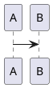

# WeChat Format (微信排版)

Converts Markdown into a self-contained HTML file styled for WeChat Official Account articles.

## Input / Output

| | |
|---|---|
| **Input** | Markdown text (standard + extensions below) |
| **Output** | Single `.html` file, CSS embedded in `<style>`, ready to paste into 微信公众号编辑器. Written to `web-chat-artifacts/<name>.html` (see [Output Path](#output-path)). |
| **Theme** | Recommended automatically based on content, then confirmed with user. Options: `default`, `grace`, `simple`, `birch` |

## Workflow

```
1. Read the user's content, understand its tone (formal/casual/creative/technical) and genre (analysis/tutorial/essay/announcement). Recommend the best-fitting theme with a one-sentence rationale, then briefly list the other options so the user can confirm or override. Never silently pick a theme without showing the choice.

2. Analyze content structure → identify semantic units.
   Scan the Markdown for:
   - Core thesis / key question → callout
   - Critical warnings / danger points → danger card
   - Key quotes / insights → filled quote card
   - Sequential steps / principles → flow-list + flow-step
   - Takeaways / conclusions → insight-list

3. Render Markdown → HTML, mapping each identified semantic unit to the appropriate component. Keep ordinary prose as standard GFM elements (`<p>`, heading, list, etc.). Do not wrap every paragraph in a component — components are only for key information nodes.

4. Load theme CSS from references/, resolve CSS variables with user's config. **Extract the resolved background color (e.g. `#FAF9F5`) and record it for use in the output template — it must be applied to both `body` and `#output` to prevent margin collapse from revealing white body background.**

5. Assemble into self-contained HTML using the output template:
   5.1 Run WeChat compatibility transforms on the rendered content (details in [WeChat Compatibility Transforms](#wechat-compatibility-transforms)):
     - Wrap `<svg>` inside `.mermaid-diagram` with `<section>` to prevent WeChat from stripping it
     - Add `style="fill:#333333!important;color:#333333!important;stroke:none!important"` to all `<tspan>` elements to preserve diagram text color
     - Replace SVG `dominant-baseline` attribute with equivalent `dy` offset
     - Convert `img` tag `width`/`height` attributes to inline `style`
   5.2 Fill the output template with transformed content and resolved CSS

6. Write the HTML file to `{inputDir}/web-chat-artifacts/{name}.html` (see [Output Path](#output-path)). Present the file path to the user.
```

## Syntax Reference

All Markdown below converts to WeChat-compatible HTML. Each element gets a CSS class (not inline style), so themes control the visual appearance.

### Standard GFM

| Element | Syntax | Output class |
|---------|--------|-------------|
| Heading | `#` ~ `######` | `h1` ~ `h6` |
| Paragraph | plain text | `p` |
| Bold | `**text**` | `strong` |
| Italic | `*text*` | `em` |
| Inline code | `` `code` `` | `codespan` |
| Code block | ```` ```lang ```` | `pre.code__pre > code.language-{lang}` |
| Link | `[text](url)` | `<a>` |
| Image | `` | `<figure>` |
| Image + size | `` | `` |
| Ordered list | `1. item` | `ol > li.listitem` |
| Unordered list | `- item` | `ul > li.listitem` |
| Table | GFM pipe table | `table.preview-table > thead/th/tr/td` |
| Blockquote | `> text` | `blockquote` |
| HR | `---` / `***` / `___` | `hr.hr-dash` / `hr-star` / `hr-underscore` |

### WeChat Extensions

#### Text Markup
```
==highlight==      → <span class="markup-highlight">   (黄底/主题色底白字)
++underline++      → <span class="markup-underline">   (主题色下划线)
~wavyline~         → <span class="markup-wavyline">    (主题色波浪线)
```

#### Ruby Annotation (注音)
```
[文字]{zhù yīn}
[文字]^(zhu yin)
```
→ `<ruby>` tag; use `・` `．` `。` `-` to split multi-char ruby.

#### GFM Alerts / Obsidian Callouts
```
> [!NOTE]     > [!TIP]      > [!IMPORTANT]  > [!WARNING]  > [!CAUTION]
> [!ABSTRACT] > [!SUMMARY]  > [!TODO]       > [!SUCCESS]  > [!DONE]
> [!QUESTION] > [!HELP]     > [!FAILURE]    > [!DANGER]   > [!ERROR]
> [!BUG]      > [!EXAMPLE]  > [!QUOTE]      > [!CITE]     > [!INFO]
```

Each renders as:
```html
<blockquote class="markdown-alert markdown-alert-{type}">
  <p class="markdown-alert-title alert-title-{type}"><svg icon>Title</p>
  content...
</blockquote>
```

Container variant:
```
::: note
content
:::
```

#### Image Slider
```
<,,>
```
→ Horizontal scroll container with `` and `<<< 左右滑动看更多 >>>` hint.

#### LaTeX (KaTeX)
```
行内: $E=mc^2$
块级: $$E=mc^2$$
```

#### Diagrams
````


```infographic
```
````
→ Rendered as SVG, embedded inline. PlantUML uses `inlineSvg: true` mode specifically for WeChat.

#### Footnotes
```
text[^1]
[^1]: description
```
→ Superscript `[n]` in text, collected at bottom in `<p class="footnotes">`.

#### Table of Contents
```
[TOC]
```

#### Diff Code Blocks
````
```diff-js
+ console.log('added')
- console.log('removed')
```
````
→ `+` lines green bg, `-` lines red bg, rest normal highlight.

#### Code Block Decorations
Code blocks always include the macOS traffic-light SVG:
```html
<span class="mac-sign"><svg>🔴🟡🟢</svg></span>
```
And use highlight.js syntax highlighting with class-based tokens.

### Custom Components (JSX-style)

Syntax: `<ComponentName prop="value" />` (PascalCase, self-closing or open-close).

| Component | Purpose | Key props |
|-----------|---------|-----------|
| `<MpProfile />` | WeChat account card | `mpId` `nickname` `headimg` `signature` `serviceType` `verifyStatus` |
| `<QRCodeBlock />` | QR code image | `url` `text="扫码访问"` `size=150` |
| `<AuthorBlock />` | Author info card | `name` `avatar` `bio` |
| `<TipBlock />` | Info/warning box | `type=info/success/warning/danger` `title` `content` |
| `<TableBlock />` | Advanced table | `headers='["A","B"]'` `rows='[["a","b"]]'` `striped=true` `caption` |
| `<InfoGrid />` | Key-value grid | `items='[{"label":"","value":""}]'` `cols=2` |
| `<BadgeGroup />` | Tag badges | `tags='["tag1","tag2"]'` `color="#07c160"` |

Components use CSS variables for colors (fallbacks provided). **TipBlock** has 4 color variants:
- `info` → blue `#1890ff`
- `success` → green `#52c41a`
- `warning` → yellow `#faad14`
- `danger` → red `#ff4d4f`

Component templates are inline styles + CSS variables. These use `--md-comp-*` variables:
- `--md-comp-bg`: component background (default `#fff`)
- `--md-comp-bg-secondary`: secondary bg (`#f5f5f5`)
- `--md-comp-bg-stripe`: stripe bg (`#fafafa`)
- `--md-comp-text-primary`: primary text (`#333`)
- `--md-comp-text-secondary`: secondary text (`#666`)
- `--md-comp-text-tertiary`: tertiary text (`#999`)
- `--md-comp-border-default`: border (`#e0e0e0`)
- `--md-comp-border-light`: light border (`#eee`)

## Theme System

Four themes available in `references/`. Each theme file is self-contained, using CSS variables for user-customizable values. The `birch` theme is inspired by the Birch HTML design system, featuring a warm ivory background, serif headings for publication feel, and a clean spacing scale.

### CSS Variables to Resolve

When generating the final HTML, resolve these variables to concrete values (user-configured or defaults):

| Variable | Default | Description |
|----------|---------|-------------|
| `--md-primary-color` | `#0F4C81` | Theme accent color (titles, borders, highlights) |
| `--md-font-family` | `-apple-system-font, BlinkMacSystemFont, ...` | Article font stack |
| `--md-font-size` | `16px` | Base font size |
| `--foreground` | (from theme) | Text color |
| `--blockquote-background` | (from theme) | Blockquote bg |
| `--text-muted` | `#87867F` | Muted/secondary text color (figcaptions, footnotes) |
| `--code-bg` | `#F6F0E8` | Code block warm background |

**Theme names and file mapping:**

| Theme | File | Credits |
|-------|------|---------|
| `default` (经典) | `references/theme-default.css` | Core |
| `grace` (优雅) | `references/theme-grace.css` | @brzhang |
| `simple` (简洁) | `references/theme-simple.css` | @okooo5km |
| `birch` (Birch 灵感) | `references/theme-birch.css` | Birch design system |

### Theme Recommendation Guidance

Match content type to theme when recommending:

| If the content is... | Recommend | Rationale |
|----------------------|-----------|-----------|
| Formal analysis, announcements, long-form serious reading | **default** | Blue accent + structured headings convey trust, fit dense text |
| Lifestyle, culture, design, personal stories, creative | **grace** | Soft shadows + rounded corners feel warm and approachable |
| Technical docs, quick tutorials, code-heavy, minimalist | **simple** | Clean lines reduce visual noise for focused reading |
| Thoughtful essays, narrative, publication-quality long reads | **birch** | Serif headings + warm ivory background feel like a print magazine |

Always explain your recommendation in one sentence, then briefly list alternatives so the user can confirm or override.

Examples of good recommendation wording:
- _"I'd recommend the **birch** theme — the serif headings and warm background give this essay a print-magazine feel. Alternatives: default (more formal), simple (minimal)."_
- _"This technical deep-dive works well with **simple** — clean headings reduce visual noise. Alternatives: default (structured), birch (warmer tone)."_

## Content Structuring Guide

After step 1 (theme selected), analyze the Markdown body to identify key semantic units that deserve visual emphasis beyond standard GFM.

### Component Mapping Table

| When you find... | Use this component | Example |
|------------------|-------------------|---------|
| The article's core thesis or central question | `.callout` with `.callout-label` | "当编码不再是稀缺资源，靠编码吃饭的人该怎么办？" |
| A critical warning, urgent risk to highlight | `.card.card-danger` | "不是 AI 会取代你，而是 AI 产出了一堆你理解不了的东西" |
| A key quote or standalone insight worth emphasizing | `.card.card-filled` with larger serif text | "LLM 不会恐惧复杂度。而且它是史上最高产的程序员。" |
| A set of sequential steps, numbered principles, or action items | `<ol class="flow-list">` with `.flow-step` + `.flow-num` | 四条行动原则 / 三步操作指南 |
| Final takeaways, conclusions, or dual insights | `<ul class="insight-list">` with `.insight-marker` | 结尾两个金句收束 |

### Rules

- **Do not overuse**: Each `<section>` should contain at most one special component (callout or card). If everything is emphasized, nothing is.
- **Ordinary narrative stays as `<p>`**: Only elevate the 2–5 most critical information nodes in the entire article.
- **Flow list for numbered sequences only**: Use `.flow-list` when the Markdown has an ordered list that represents sequential steps, not arbitrary numbered items.
- **Insight list for takeaways only**: Use at the end of an article or a major section to list key conclusions.
- **Never nest components** inside each other.

### Heading Style Overrides

In addition to the theme, users can configure per-level heading styles:

| Style | CSS output |
|-------|-----------|
| `default` | Theme default |
| `color-only` | `color: var(--md-primary-color)` |
| `border-bottom` | `border-bottom: 2px solid var(--md-primary-color)` |
| `border-left` | `border-left: 4px solid var(--md-primary-color)` |

These are applied AFTER the theme CSS (higher specificity: `#output section h1`).

### Typography Notes

The `birch` theme and all enhanced themes share these typography improvements for a more refined reading experience:

- **Serif headings** (`h1`–`h3`): Use `Georgia, "Times New Roman", "PingFang SC", serif` for a publication feel. Body text remains sans-serif for comfort on mobile.
- **Text rendering**: `-webkit-font-smoothing: antialiased` + `text-rendering: optimizeLegibility` for sharper characters.
- **Spacing rhythm**: Standardized vertical spacing — `h2` gets `margin-top: 32px`, `p + p` gets `12px`, creating consistent visual flow.
- **Muted text color**: `#87867F` for figcaptions, footnotes, and secondary content — reduces visual noise.

Apply these patterns even when users don't explicitly opt in — they're universal readability improvements.

### User Customization Options

When the user provides or you infer preferences:

| Option | Values |
|--------|--------|
| Font | sans-serif / serif / monospace (see font stacks below) |
| Font size | 14px / 15px / 16px / 17px / 18px |
| Primary color | 12 presets: classic blue `#0F4C81`, emerald `#009874`, orange `#FA5151`, yellow `#FECE00`, lavender `#92617E`, sky blue `#55C9EA`, rose gold `#B76E79`, olive `#556B2F`, graphite `#333333`, smoke `#A9A9A9`, sakura pink `#FFB7C5` |
| Paragraph indent | `text-indent: 2em` on `#output p` (boolean) |
| Text justify | `text-align: justify` on `#output p` (boolean) |
| Line numbers | On code blocks (boolean) |
| Code block theme | Any highlight.js theme (e.g., `github`, `monokai-sublime`, `atom-one-dark`) |

Font stacks:
- **Sans-serif**: `-apple-system-font, BlinkMacSystemFont, Helvetica Neue, PingFang SC, Hiragino Sans GB, Microsoft YaHei UI, Microsoft YaHei, Arial, sans-serif`
- **Serif**: `Optima-Regular, Optima, PingFangSC-light, PingFangTC-light, 'PingFang SC', Cambria, Cochin, Georgia, Times, 'Times New Roman', serif`
- **Monospace**: `Menlo, Monaco, 'Courier New', monospace`

## WeChat Compatibility Transforms

Applied during step 5.1. Each transform is a lossless equivalence — browser rendering is unchanged.

### Mermaid SVG Wrap

WeChat strips bare `<svg>`. Wrap in `<section>` to preserve.

```
Before: <div class="mermaid-diagram"><svg ...>...</svg></div>
After:  <div class="mermaid-diagram"><section style="max-width:100%;overflow-x:auto;-webkit-overflow-scrolling:touch"><svg ...>...</svg></section></div>
```

Apply to all `<svg>` inside any element with class `mermaid-diagram`.

### SVG Text Color

WeChat overwrites `<tspan>` fill color. Force with `!important`.

```
Before: <tspan class="...">text</tspan>
After:  <tspan class="..." style="fill:#333333!important;color:#333333!important;stroke:none!important">text</tspan>
```

If `<tspan>` already has `style`, append these declarations.

### SVG dominant-baseline → dy

WeChat X5 kernel and Safari don't support `dominant-baseline`. Replace with equivalent `dy` offset.

| Value | dy |
|-------|-----|
| `hanging` | `-0.55em` |
| `central` | `0.35em` |
| `middle` | `0.35em` |
| `alphabetic` | *(remove attr, no dy)* |
| `ideographic` | `0.18em` |
| `text-before-edge` | `-0.85em` |
| `text-after-edge` | `0.15em` |

```
Before: <text dominant-baseline="hanging" x="0" y="0">text</text>
After:  <text dy="-0.55em" x="0" y="0">text</text>
```

### Image Sizing → Inline Style

WeChat strips `width`/`height` attributes but respects inline `style`.

- Pure number (e.g., `300`) → `300px`
- Non-numeric (e.g., `50%`) → preserved
- Remove original attribute
- Append to existing `style` if present

```
Before: 
After:  
```

## Output Path

| | |
|---|---|
| **Directory** | `web-chat-artifacts/` — created as a subdirectory of the directory containing the input Markdown file |
| **Filename** | `{input-stem}.html` — same stem as the input file, with `.html` extension |
| **Auto-create** | Create the `web-chat-artifacts/` directory if it does not exist |

Examples:

| Input | Output |
|-------|--------|
| `articles/deep-dive.md` | `articles/web-chat-artifacts/deep-dive.html` |
| `./my-post.md` | `./web-chat-artifacts/my-post.html` |
| `docs/tutorials/guide.md` | `docs/tutorials/web-chat-artifacts/guide.html` |

## Output Template

```html
<!DOCTYPE html>
<html lang="zh-CN">
<head>
<meta charset="UTF-8">
<meta name="viewport" content="width=device-width, initial-scale=1.0">
<title>{article title}</title>
<style>
/* ===== Base & Theme CSS ===== */
/* resolved from theme file + user config */
/* body background MUST match #output background to prevent margin collapse revealing white body bg */
body { background: {resolved-theme-bg-color}; }
/* heading style overrides if any */
/* custom CSS if any */
</style>
</head>
<body>
<div id="output">
  <section class="container mx-auto">

    {rendered HTML content}
    {reading-time block if requested}
    {footnotes block if any}

  </section>
</div>
</body>
</html>
```

### Reading Time Block
```html
<blockquote class="md-blockquote">
  <p class="md-blockquote-p">字数 {wordCount}，阅读大约需 {minutes} 分钟</p>
</blockquote>
```

### Footnotes Block
```html
<h4>引用链接</h4>
<p class="footnotes">
  <code style="font-size:90%;opacity:0.6;">[1]</code>: <i>title</i><br/>
  ...
</p>
```

### color-mix Resolution

Since WeChat X5 Blink kernel does not support CSS `color-mix()`, each `color-mix()` call must be pre-computed to `rgba()` before output.

**Calculation method** for `color-mix(in srgb, color1 p1, color2 p2)`:

1. Parse both color values to sRGB components `(r1, g1, b1)` and `(r2, g2, b2)` in 0–1 range
2. Normalize percentages: `t = p1 / (p1 + p2)` (if only one percentage given, the other is `100% - p1`)
3. Interpolate each channel: `result = c1 × t + c2 × (1 - t)`
4. Convert back to `rgba(r, g, b, a)`, where each channel is rounded to integer 0–255

**Example**:

```css
/* Source */
--color: color-mix(in srgb, #0F4C81 10%, white);
/* Resolved */
--color: rgba(229, 237, 244, 1);
```

(即使主题 CSS 当前未使用 `color-mix()`，此方法适用于用户自定义配置或未来主题更新。)

## WeChat-Specific Caveats

These are critical — WeChat's rendering engine (X5 Blink) has unique behaviors:

1. **No CSS functions or variables**: Resolve all of these before output:
   - `var(--md-*)` → concrete value (e.g., `var(--md-primary-color)` → `#0F4C81`)
   - `hsl(var(--foreground))` → hex or static hsl (e.g., `hsl(0, 0%, 20%)` → `#333333`)
   - `color-mix(in srgb, ...)` → pre-computed `rgba()` (see [color-mix resolution](#color-mix-resolution))
   - `calc(var(--md-font-size) * 1.4)` → concrete px (e.g., `calc(16px * 1.4)` → `22.4px`)

2. **No external resources**: All CSS must be inline `<style>`. No external stylesheets, no `@import`, no webfonts. Images must use absolute URLs to hosted images (use the user's configured image hosting).

3. **`overflow-x: scroll` works**: The horizontal slider pattern uses WeChat-compatible `section` layout with `-webkit-overflow-scrolling: touch`. The scroll hint text `<<< 左右滑动看更多 >>>` is important — WeChat users need this cue.

4. **`<section>` is your friend**: WeChat's editor strips many HTML tags but preserves `<section>`, `<p>`, `<span>`, ``, `<a>`, `<blockquote>`, `<table>`, `<ul>/<ol>/<li>`, `<pre>/<code>`, `<h1>`-`<h6>`, `<figure>`, `<hr>`, `<ruby>`. Use these.

5. **`<style>` inside `<body>`**: WeChat _may_ strip `<style>` from `<head>`. To be safe, you can place a `<style>` tag inside `<body>` (before the content), but preferably keep it in `<head>` — most modern WeChat WebViews handle this.

6. **Tables need scroll wrapper**: Always wrap tables in `<section style="max-width:100%;overflow:auto;-webkit-overflow-scrolling:touch">` for mobile.

7. **Links to mp.weixin.qq.com**: Keep as normal `<a>` tags. External links should include `target="_blank"` or use the footnote system (superscript + bottom list).

8. **Code block copy safety**: Use `user-select:none` on the macOS traffic-light dots so they don't copy with the code. Use `user-select:all` or nothing on the actual code.

9. **Image sizing**: The `` extension is non-standard Markdown. The renderer extracts dimensions and sets `width`/`height` attributes on ``.

10. **Dark mode**: Each theme should provide dark mode styles via `prefers-color-scheme: dark`. The component system uses CSS variables with light fallbacks — dark mode overrides these.

11. **`color-mix()` not supported**: WeChat X5 Blink kernel does not support CSS `color-mix()`. When resolving the theme CSS for final output, replace every `color-mix()` call with a pre-computed `rgba()` value. See the [color-mix Resolution](#color-mix-resolution) section above for the calculation method.
