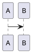

# Syntax Reference

## Standard GFM

All elements use the `style-block` strategy: semantic HTML, all styles in `<style>`, no inline `style=""` except `compat-wrap` transforms.

| Element | Syntax | Output element |
|---------|--------|-------------|
| Heading | `#` ~ `######` | `h1` ~ `h6` |
| Paragraph | plain text | `p` |
| Bold | `**text**` | `strong` |
| Italic | `*text*` | `em` |
| Inline code | `` `code` `` | `codespan` |
| Code block | ```` ```lang ```` | `pre.code__pre > code.language-{lang}` |
| Link | `[text](url)` | `<a>` |
| Image | `` | `<figure>` |
| Image + size | `` | `` |
| Ordered list | `1. item` | `ol > li.listitem` |
| Unordered list | `- item` | `ul > li.listitem` |
| Table | GFM pipe table | `table.preview-table > thead/th/tr/td` |
| Blockquote | `> text` | `blockquote` |
| HR | `---` / `***` / `___` | `hr.hr-dash` / `hr-star` / `hr-underscore` |

All `` styles (`display: block; max-width: 100%; margin: 0.1em auto 0.5em; border-radius: 6px;`) go in the `<style>` block via `#output img` selector. No `!important` on regular content images — reserve `!important` only for `compat-wrap` transforms.

## WeChat Extensions

### Text Markup

```
==highlight==      → <span class="markup-highlight">   (黄底/主题色底白字)
++underline++      → <span class="markup-underline">   (主题色下划线)
~wavyline~         → <span class="markup-wavyline">    (主题色波浪线)
```

### Ruby Annotation (注音)

```
[文字]{zhù yīn}
[文字]^(zhu yin)
```

→ `<ruby>` tag; use `・` `．` `。` `-` to split multi-char ruby.

### GFM Alerts / Obsidian Callouts

```
> [!NOTE]     > [!TIP]      > [!IMPORTANT]  > [!WARNING]  > [!CAUTION]
> [!ABSTRACT] > [!SUMMARY]  > [!TODO]       > [!SUCCESS]  > [!DONE]
> [!QUESTION] > [!HELP]     > [!FAILURE]    > [!DANGER]   > [!ERROR]
> [!BUG]      > [!EXAMPLE]  > [!QUOTE]      > [!CITE]     > [!INFO]
```

Each renders as:

```html
<blockquote class="markdown-alert markdown-alert-{type}">
  <p class="markdown-alert-title alert-title-{type}"><svg icon>Title</p>
  content...
</blockquote>
```

Container variant:

```
::: note
content
:::
```

### Image Slider

```
<,,>
```

→ Horizontal scroll container with `` and `<<< 左右滑动看更多 >>>` hint.

### LaTeX (KaTeX)

```
Inline: $E=mc^2$
Block:  $$E=mc^2$$
```

### Diagrams

````


```infographic
```
````

→ Rendered as SVG, embedded inline. PlantUML uses `inlineSvg: true` mode specifically for WeChat.

### Footnotes

```
text[^1]
[^1]: description
```

→ Superscript `[n]` in text, collected at bottom in `<p class="footnotes">`.

### Table of Contents

```
[TOC]
```

### Diff Code Blocks

````
```diff-js
+ console.log('added')
- console.log('removed')
```
````

→ `+` lines green bg, `-` lines red bg, rest normal highlight.

### Code Block Decorations

Code blocks always include the macOS traffic-light SVG:

```html
<span class="mac-sign"><svg>🔴🟡🟢</svg></span>
```

Use highlight.js syntax highlighting with class-based tokens.
